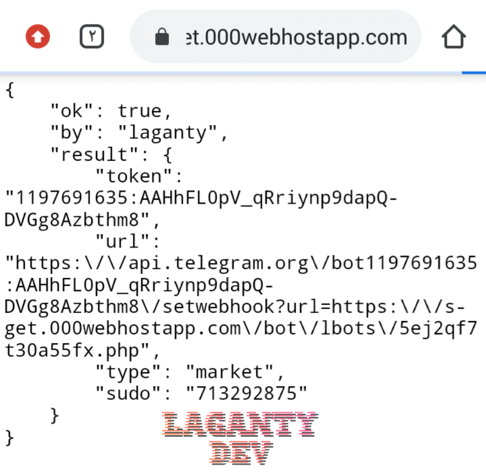

# bostinger API
The API has completed the bot factory Current
 bot types:
 1. Visa
 2. market

 # Method:
 You take this link: 
`https://domain.com/bot/make.php?token=*Token Bot*`

add your bot tiken and add this second:

`&sudo=*admin_id*&type=*bot_type*`

add your ID and bot type you need

then you well get a link like that:

`https://domain.com/bot/make.php?token=5844:ajh_uwj774jsj&sudo=826926595&type=visa`

and put it in your browser and look at the details it right or not if ,right wait 10s the site well redrict you to telegram webhook,
 else if it's wrong close the page and start again

</img>

# notes
1. theres a 2 bot types ( visa & market) you can add more
2. 000webhost well ban you drictly :)
3. dont ever delete my lecince fool!
4. upload the project in folder and name it *bot* or edit in `make.php`
5. the bots it's not my program !!!

# more info
1. bot files well be added to *lbots* folder
2. *srsc* folder it's for bot files

# contact 
TELEGRAM: http://t.me/laganty

MAIL: anasybal@gmail.com

INSTAGRAM: http://instagram.com/lagan.ty

